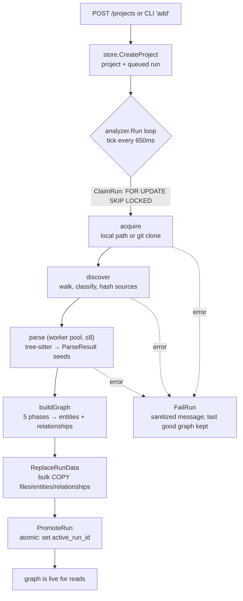
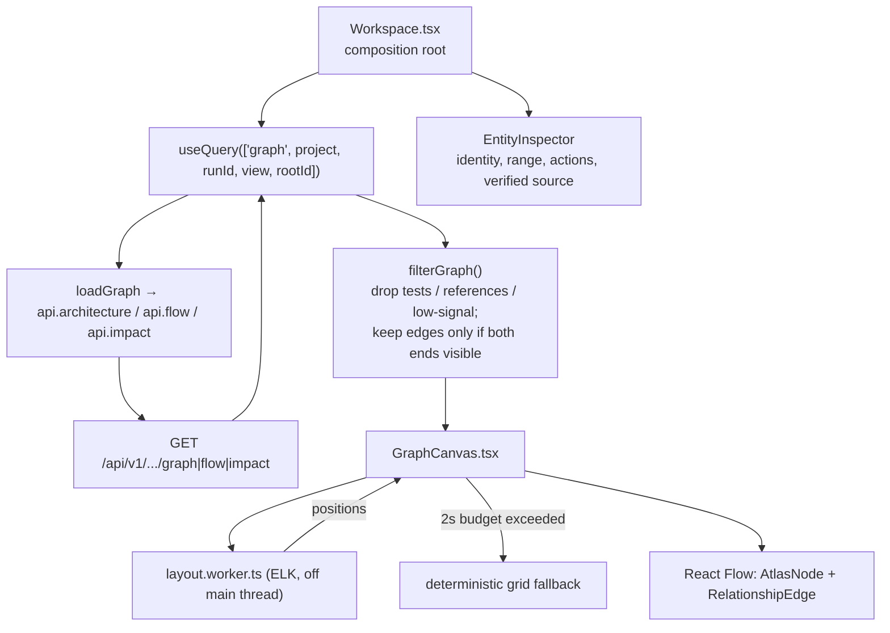

# CodeAtlas — Architecture & Data Flow

> A local-first **code-intelligence graph** for JavaScript, TypeScript, Go, and Python.
> It parses a repository with Tree-sitter, stores **metadata only** (never source) in
> PostgreSQL, and serves an embedded React graph explorer. Everything binds to loopback.

This document explains what CodeAtlas is, the features it exposes, how the pieces fit
together, and — in detail — how data flows from a repository on disk to the interactive
graph in the browser.

---

## 1. What it is

CodeAtlas answers questions like *"what does this codebase contain, how do its modules
depend on each other, what does this function call, and what breaks if I change it?"* —
without shipping your source anywhere.

Two design commitments shape everything:

1. **Privacy boundary.** Source buffers are read, parsed, and immediately discarded. The
   database holds only structural metadata (paths, hashes, symbol ranges, relationships).
   Source is re-read from disk on demand and rejected if its hash changed.
2. **Local-first & loopback-only.** The Go server binds to `127.0.0.1`, rejects
   non-loopback `Host`/`Origin`, uses no external services, and embeds the production
   frontend inside the binary.

---

## 2. Feature overview

| Feature | What it does | Where it lives |
| --- | --- | --- |
| **Repository registration** | Add a local absolute path or an HTTPS/SSH Git URL. Managed clones use the local credential helper / SSH agent; credentials are never stored. | `internal/repository/acquire.go`, `api/projects.go` |
| **Inventory & classification** | Walks the tree; classifies each entry as `source`, `support`, or `skipped` and records *why* it was skipped. | `internal/repository/discover.go` |
| **Privacy / ignore exclusions** | Hard safety rules (secrets, binaries, >1 MiB, symlinks) plus `.gitignore` and `.codeatlasignore`. | `discover.go`, `internal/repository/ignore.go` |
| **Multi-language parsing** | Tree-sitter adapters for JS/TS/Go/Python, with a no-CGO structural fallback so dev builds work without a C toolchain. | `internal/parser/*` |
| **Symbol graph** | Extracts modules, files, functions/methods, classes/structs/interfaces, routes; links them with `contains`, `defines`, `imports`, `exports`, `calls`, `handles_route`, `uses_middleware`, `depends_on`. | `internal/analyzer/*` |
| **Route detection** | Express & Next.js (JS/TS), `net/http` & Gin (Go), FastAPI & Flask (Python). | `internal/parser/*` |
| **Architecture explorer** | Progressive disclosure: module overview → module neighborhood → file declarations. Never flattens the whole repo onto one canvas. | `store/graph.go`, `web/src/features/graph/*` |
| **Flow view** | From a selected symbol, traces **downstream** execution (`calls`, `handles_route`, `uses_middleware`). | `store.FlowGraph` |
| **Impact view** | From a selected symbol, traces the **change blast radius** upstream/downstream. | `store.ImpactGraph` |
| **Symbol search** | Trigram-backed fuzzy search over qualified names. | `store.Search` (`pg_trgm`) |
| **Verified source evidence** | On demand, re-reads a symbol's source window from disk, but only if the file hash still matches analysis time. | `api/source.go` |
| **Skipped-file inspector** | Explains every visited exclusion; ignored directories are recorded once, not enumerated. | `web/src/features/files/SkippedFiles.tsx` |
| **Signal filters** | Hide test code and "reference noise" (external/unresolved symbols) by default; toggle to reveal. | `web/src/lib/graph.ts`, `store.ts` |
| **Live analysis progress** | Server-Sent Events stream stage/percent while a run executes. | `api/analysis.go`, `useAnalysisEvents.ts` |
| **Local shutdown** | Explicit endpoint to stop the local process from the UI. | `api/system.go` |

---

## 3. System topology

```
┌───────────────┐        HTTP/JSON + SSE (loopback only)        ┌────────────────────────┐
│  React SPA    │  ◀────────────────────────────────────────▶  │   Go server (api)      │
│ (embedded in  │      /api/v1/...                              │  security middleware   │
│  the binary)  │                                              │  REST + SSE handlers   │
└───────────────┘                                              └───────────┬────────────┘
                                                                           │
                          ┌───────────────────────────────────────────────┼───────────────┐
                          │                                                │               │
                   ┌──────▼───────┐                               ┌────────▼───────┐  ┌────▼─────┐
                   │  analyzer    │  claims queued runs, runs     │     store      │  │  webui   │
                   │  (job loop)  │  the pipeline, writes graph   │  (PostgreSQL)  │  │ go:embed │
                   └──────┬───────┘                               └────────────────┘  └──────────┘
              ┌───────────┼────────────┐
        ┌─────▼────┐ ┌────▼─────┐ ┌────▼──────┐
        │repository│ │ parser   │ │  id       │
        │ acquire/ │ │ tree-    │ │ stable    │
        │ discover │ │ sitter   │ │ hashing   │
        └──────────┘ └──────────┘ └───────────┘
```

The analyzer and the API server run in the **same process** (`cmd/codeatlas serve`) but on
separate goroutines. They communicate only through PostgreSQL — the analyzer is a durable
job worker, and the API never calls the analyzer directly.

### Package map (`internal/`)

| Package | Responsibility |
| --- | --- |
| `model` | Shared domain types and the two controlled vocabularies: `EntityKinds` and `RelationshipKinds`. Everything keys off these strings. |
| `repository` | Safe Git acquisition, filesystem discovery, SHA-256 hashing, ignore rules. |
| `parser` | Tree-sitter adapters (`//go:build cgo`) and a structural fallback (`parser_fallback.go`). Returns a `ParseResult` of entity/import/reference *seeds*. |
| `analyzer` | The orchestrator: job loop + the graph-building pipeline. |
| `id` | Deterministic stable IDs (`id.Stable(runID, parts...)`) so re-analysis is reproducible. |
| `store` | All PostgreSQL access: schema/migrate, durable job lease, atomic promotion, search, and graph traversal via recursive CTEs. |
| `api` | Loopback security, project lifecycle, SSE, graph handlers, source evidence, shutdown. |
| `webui` | `//go:embed dist/*` — serves the built SPA and falls back to `index.html` for client routes. |

---

## 4. Data model

Every row is scoped to a **run** (`run_id`). A project points at its `active_run_id`; all
reads join through `projects.active_run_id`, so an in-progress run is invisible until it is
atomically promoted. (Schema: `internal/store/schema.sql`.)

```
projects ──1:N──▶ analysis_runs
   │  active_run_id (deferrable FK) ─────┐
   │                                     ▼
   └──────────── files ─────────── entities ─────────── relationships
                 (run_id)          (run_id, file_id)     (run_id, source→target)
```

- **`projects`** — identity, source (local/git), status, and the pointer to the live run.
- **`analysis_runs`** — durable job record: `status`, `stage`, `completed/total`,
  `lease_until` (for crash-safe re-claiming), timestamps.
- **`files`** — one row per visited path: `classification` (`source`/`support`/`skipped`),
  `ignore_reason`, `language`, `is_test`, `size_bytes`, and `content_hash` (kept server-side
  only — JSON-hidden).
- **`entities`** — nodes. `kind` ∈ `EntityKinds`, plus `qualified_name`, source `range`, and
  a JSONB `metadata` bag.
- **`relationships`** — edges. `relationship_type` ∈ `RelationshipKinds`, plus `confidence`,
  `resolution_state` (`resolved`/`inferred`/`external`/`unresolved`), and evidence range.

**Vocabularies** (`internal/model/model.go`):

- Entity kinds: `package, module, file, function, method, class, struct, interface, route,
  external_symbol, unresolved_symbol`.
- Relationship kinds: `contains, defines, imports, exports, calls, handles_route,
  uses_middleware, depends_on`.

Key indexes: a claim index on `(status, lease_until, created_at)`, a GIN **trigram** index on
`entities.qualified_name` for fuzzy search, and source/target indexes on relationships for
fast traversal.

---

## 5. The analysis pipeline (write path)

This is how a repository on disk becomes a graph in the database. Entry point:
`analyzer.Service.analyze` (`internal/analyzer/service.go`).



**Stage by stage:**

1. **Claim** — `store.ClaimRun` selects the oldest `queued` run (or a `running` run whose
   45-second `lease_until` expired) with `FOR UPDATE SKIP LOCKED`, so multiple workers never
   grab the same job and a crashed run is safely re-claimed. Each `UpdateRun` renews the lease.
2. **Acquire** (`repository.Acquire`) — for local projects this validates the path; for git
   it performs a managed clone using the local credential helper / SSH agent. Returns the
   resolved commit.
3. **Discover** (`repository.Discover`) — `filepath.WalkDir` over the canonical (symlink-resolved)
   root. Each entry becomes a `FileRecord`:
   - **Hard safety** first: symlinks are not followed; secret-like files (`.env*`, `*.pem`,
     `*.key`, `id_rsa`, `credentials`, …), binaries (by extension or NUL-byte sniff), and
     files > 1 MiB are excluded with a reason.
   - Then **ignore rules**: `.gitignore` + `.codeatlasignore`. Ignored directories are recorded
     once and pruned (`SkipDir`) without enumerating descendants.
   - Survivors are classified `source` (known extension → language, hashed with SHA-256, tagged
     `is_test`), `support` (e.g. `package.json`, `go.mod` — read transiently for import
     resolution), or `skipped` (unsupported type). MVP cap: **10 000** source files.
4. **Parse** (`Service.parseFiles`) — a bounded worker pool (`min(NumCPU, 8)`) parses each source
   file. A process-local cache keyed by `language\x00path\x00contentHash` reuses results for
   unchanged files across runs — **metadata only; no source or AST is retained.** Progress is
   flushed to the run row at most every 500 ms.
   - With CGO, `parser.Parse` drives the real Tree-sitter grammars (`.tsx` uses the TSX grammar).
   - Without CGO, `parser_fallback.go` provides a conservative structural parser.
   - A parser produces **seeds**: `EntitySeed` (declarations, routes), `ImportSeed`, and
     `ReferenceSeed` (calls / route handlers / middleware) — all with source ranges and a
     confidence. Nothing is resolved across files yet.
5. **Build graph** (`analyzer.buildGraph`) — a single-threaded `graphBuilder` runs five ordered
   phases (`graph.go`, `declarations.go`, `relationships.go`, `resolution.go`):

   | Phase | Produces |
   | --- | --- |
   | `indexFiles` | Registers file records and parse results by path. |
   | `addStructuralEntities` | One `module` per directory + one `file` entity per source file, joined by `contains`. Marks a module `is_test` if all its files are tests. |
   | `addDeclarations` | Promotes each declaration seed to an `entity`, linked from its file by `defines`. Indexes symbols by name and qualified name for resolution. |
   | `addImports` | Resolves each import to a file entity (`resolved`), or synthesizes an `external_symbol` (`external`). |
   | `addReferences` | Resolves calls/route/middleware seeds against the symbol index; unresolved targets become an `unresolved_symbol` node. |

   Resolution (`resolution.go`) tries, in order: exact qualified-name match → same-file/scope
   match → imported-module match → single-candidate inference, assigning decreasing confidence
   (`1.0 → 0.72`). IDs are deterministic (`id.Stable`), so identical input yields identical
   graphs. Finally entities are sorted and relationships de-duplicated.
6. **Persist** (`store.ReplaceRunData`) — inside one transaction: delete any prior rows for this
   run, then bulk-load files, entities, and relationships with `COPY`. `content_hash` is written
   here; `metadata` is JSON-encoded.
7. **Promote** (`store.PromoteRun`) — atomically flips the run to `ready` and sets the project's
   `active_run_id`. **Failed or partial runs never replace the last valid graph** — `FailRun`
   only marks the run failed (with a path-sanitized message) and leaves the previous
   `active_run_id` intact. A short grace window then garbage-collects superseded ready runs.

---

## 6. The graph read model (read path)

Reads are deliberately **small and progressive** — the UI never asks for the whole graph.
All read queries live in `internal/store/graph.go` and join through `projects.active_run_id`.

### Architecture explorer — progressive disclosure

```
Overview            module cards (aggregated file/symbol/route counts)   ArchitectureGraph(scope="")
   │  double-click / "Open contents"
   ▼
Module              its immediate file neighborhood                      NeighborhoodGraph(module)  → contains
   │
   ▼
File                its declarations + direct dependencies               NeighborhoodGraph(file)    → defines/imports/exports
```

- `ArchitectureGraph` with no scope returns **module aggregates**: each module card carries
  `fileCount`, `symbolCount`, `routeCount`, `testFileCount`, ordered by route/symbol density.
- `moduleEdges` aggregates file-level `imports`/`calls`/`depends_on` up to **module→module**
  edges (with a count and whether every underlying edge resolved).
- Supplying a `scope` entity ID drills into `NeighborhoodGraph` — one root plus its direct
  neighbors, with the edge kinds chosen by the root's kind.

### Flow & Impact — symbol-rooted traversal

Both are thin wrappers over `traversalGraph`, a **recursive CTE** that walks the relationship
graph from a root, tracking depth and the visited `path[]` to prevent cycles:

- **Flow** (`FlowGraph`) — direction `downstream`, kinds `handles_route, uses_middleware, calls`,
  default depth 6. "What does this symbol execute?"
- **Impact** (`ImpactGraph`) — direction `both` (or `upstream`/`downstream`), kinds `calls,
  handles_route, uses_middleware, imports, depends_on`, default depth 4. "What is the blast
  radius of changing this symbol?" — depth is the impact *radius*.

Safety caps apply to every traversal: **depth ≤ 12**, **nodes ≤ 500** (the UI requests smaller
80/120-node budgets). Each node carries its `distance` from the root; edges are only returned
when **both endpoints are in the node set**, so no orphaned edges leak out.

---

## 7. Frontend architecture & data flow

React 19 + TypeScript, built with Vite 7 and Tailwind v4. `npm run build` writes straight to
`internal/webui/dist`, which the Go binary embeds — **rebuild it after any frontend change.**

### State ownership

- **TanStack Query** owns all server state: fetching, cancellation (`AbortSignal`), polling,
  retries, and cache invalidation. Query keys encode `activeRunId`, so a new analysis run
  invalidates cached graphs automatically.
- **Zustand** (`store.ts`) holds only cross-workspace **interaction** state: `projectId`,
  `selectedEntityId`, `graphView` (`architecture | flow | impact`), and the two signal filters
  (`showTests`, `showReferences`). Nothing server-derived lives here.

### Render flow (a workspace session)



Key behaviors:

- **`filterGraph`** (`lib/graph.ts`) hides test nodes and reference noise
  (`external_symbol`/`unresolved_symbol`) and any non-architectural kind, then drops edges whose
  endpoints were removed. The selected node and graph root are always preserved.
- **Layout runs in a Web Worker** (`layout.worker.ts`) using ELK's layered algorithm
  (architecture → `RIGHT`, flow/impact → `DOWN`). If layout exceeds a **2-second budget**, the
  canvas falls back to a deterministic grid so the UI never hangs.
- **`graphLayoutKey`** includes edge topology, so a same-size graph with different edges cannot
  reuse stale node positions.
- **Render budgets**: cards mount only when visible (`onlyRenderVisibleElements`); dense views
  (> 60 nodes) go compact, suppress edge labels (≤ 30 only), and disable animation; the MiniMap
  only appears under 70 nodes.
- **Monaco** and the four syntax tokenizers are bundled locally and **lazy-loaded** only when
  verified source evidence is opened.

### Verified source evidence

When you open source for a symbol, the client calls `GET /entities/{id}/source`. The server
(`api/source.go`) re-reads the file from disk, confirms the path is within the repo, and
**constant-time compares** the current SHA-256 to the hash stored at analysis time:

- match → returns a bounded window (`±3` context lines, ≤ 400 lines);
- mismatch → `409 source_stale` ("reanalyze the project");
- missing → `404 source_unavailable`.

This is the privacy boundary in action: source lives only on disk and is never trusted from a
stale cache.

---

## 8. HTTP API

Rooted at `/api/v1`. Registered in `internal/api/server.go`; every request passes the loopback
security middleware first.

| Method & path | Purpose |
| --- | --- |
| `GET /health` | Liveness. |
| `POST /system/shutdown` | Stop the local process (requires intent header). |
| `GET /projects` | List projects with their latest run. |
| `POST /projects` | Register a local path or Git URL; queues a run. Returns `202`. |
| `GET /projects/{id}` | Project detail + latest run. |
| `DELETE /projects/{id}` | Remove a project and all derived metadata. |
| `POST /projects/{id}/analyses` | Queue a re-analysis. |
| `GET /projects/{id}/events` | **SSE** stream of live run progress. |
| `GET /projects/{id}/files` | File inventory (filter by `classification`). |
| `GET /projects/{id}/search?q=` | Trigram symbol search. |
| `GET /projects/{id}/graph/architecture?scope=` | Module overview or a scoped neighborhood. |
| `GET /projects/{id}/flow/{entityID}` | Downstream execution flow. |
| `GET /projects/{id}/impact/{entityID}?direction=` | Impact / blast-radius traversal. |
| `GET /projects/{id}/entities/{entityID}` | Entity detail. |
| `GET /projects/{id}/entities/{entityID}/source` | Hash-verified source window. |

Everything else (`/`) is served by the embedded SPA, which falls back to `index.html` for
client-side routes.

---

## 9. Security & privacy boundary (summary)

- **Loopback only.** Middleware rejects non-loopback `Host` and cross-origin `Origin`; sets
  `nosniff`, `no-referrer`, a strict CSP, and `no-store` on API responses.
- **No source in the database.** Only paths, hashes, ranges, symbols, and relationships. Source
  buffers are discarded right after parsing; source is re-read on demand and hash-verified.
- **Hard exclusions** for secrets, binaries, oversized files, and symlinks — applied before any
  ignore rules and independent of them.
- **No external anything** — no AI provider, analytics, external fonts, or telemetry. The CSP
  forbids off-origin requests.
- **Git credentials** are never accepted in URLs or stored; managed clones defer to the local
  credential helper or SSH agent.
- **Sanitized errors.** Failure messages strip the repository root and are length-capped before
  they touch the database or the client.

---

## 10. Build, run, and test

```powershell
# Prerequisites: Go 1.26+, Node 22.12+ (or 20.19+), Docker, Git, (optional) a C toolchain.

docker compose up -d postgres     # PostgreSQL on loopback :5433
cd web && npm install && npm run build && cd ..   # writes internal/webui/dist
go run ./cmd/codeatlas serve       # http://127.0.0.1:7331
```

Register a repo from the UI, or from a second terminal:

```powershell
go run ./cmd/codeatlas add C:\absolute\path\to\repo
```

Frontend dev loop (Vite proxies `/api` to the Go server):

```powershell
go run ./cmd/codeatlas serve       # terminal 1
cd web && npm run dev              # terminal 2 → 127.0.0.1:5173
```

Tests:

```powershell
go test ./cmd/... ./internal/...
go vet ./cmd/... ./internal/...
cd web && npm run check && npm run build   # tsc + eslint + vitest + prettier, then build
```

Configuration (env vars): `CODEATLAS_DATABASE_URL`, `CODEATLAS_LISTEN_ADDR`,
`CODEATLAS_DATA_DIR`.

> **Note:** `internal/webui/dist` is the built SPA embedded via `go:embed`, and
> `internal/webui/webui.go` is the handler that embeds it. Both must be present for the server
> package to compile — if `webui.go` is missing, `internal/api` fails with
> *"no required module provides package .../internal/webui"*. Restore it with
> `git checkout HEAD -- internal/webui/webui.go` and rebuild the bundle.

---

## 11. Recent graph-UI & flow/impact changes

Recorded here because they affect how the graph reads and behaves:

- **Opaque node cards.** `AtlasNode` cards now render on an opaque base with tone conveyed by
  border + icon color, instead of near-transparent tinted fills. Previously the low-alpha fills
  let relationship edges bleed *through* the cards; a defensive `z-index` in `app.css` keeps the
  edge layer strictly beneath the node layer. The DOM structure and React Flow handles are
  unchanged.
- **Flow/Impact actually show their payload.** Those traversals surface external and unresolved
  calls, which the default "reference noise" filter used to hide — emptying the view. Flow and
  impact modes now always keep reference nodes (architecture still hides them).
- **Symbol-rooted guardrail.** Selecting a module or file and switching to flow/impact used to
  render a dead single-node canvas (modules have no execution edges). It now shows a
  `TraceNeedsSymbol` hint directing you to pick a function, method, or route.
